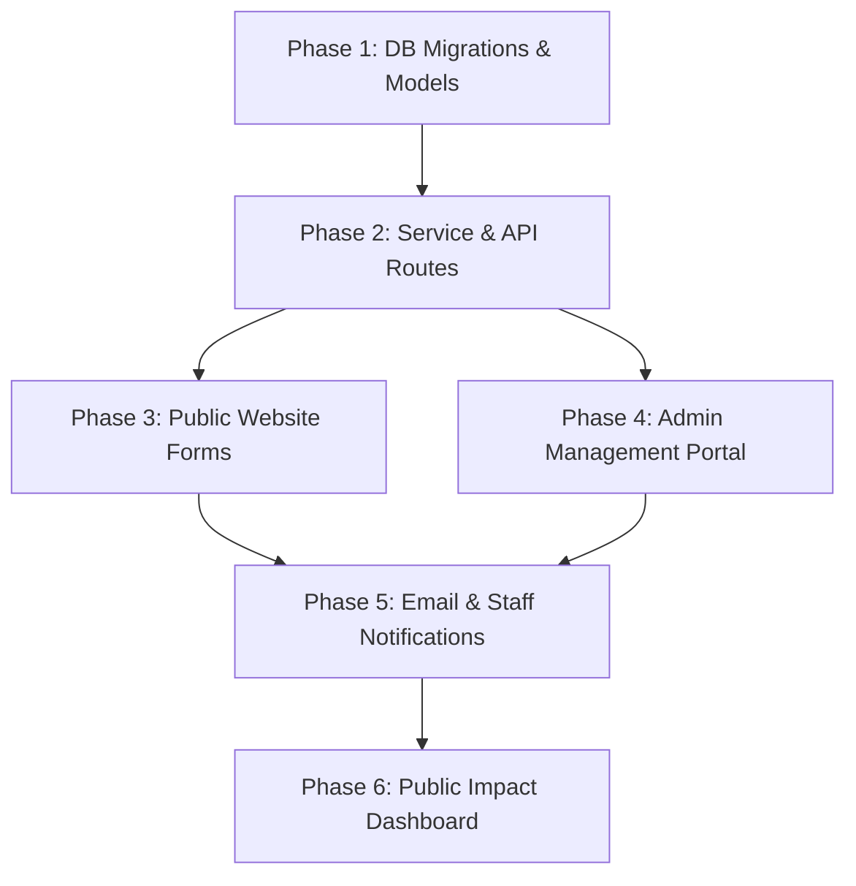

# Furrydom India NGO — "Ways to Give" Solution & Technical Implementation Plan

**Client / Project:** Furrydom India NGO  
**Document Type:** Client Solution Proposal & Technical Specification  
**Scope:** Public Website (`furrydom-front`) & Admin Backend (`furrydom-backend`)  
**Target Audience:** NGO Founder, Management Team & Engineering Team  
**Last Updated:** August 13, 2026  

---

## 1. Executive Summary & Founder's Problem Statement

### The Problem Facing Furrydom India NGO
Many passionate animal lovers and well-wishers want to support Furrydom India NGO, but face financial constraints and cannot contribute money. Simultaneously, donors who *do* have resources often prefer donating tangible items—such as **pet food, medicines, blankets, bowls, stationery, or first-aid kits**—rather than making cash transfers. 

Currently, standard online donation forms only ask for money, creating a barrier that excludes a massive portion of the community who wish to help.

### The Solution: "Ways to Give" (In-Kind & Community Contribution Platform)
The **"Ways to Give"** system transforms Furrydom India's digital platform. It allows anyone—regardless of their financial situation—to support the NGO through:
1. **Physical Goods (In-Kind Giving):** Food, medicines, blankets, stationery, rescue equipment.
2. **Time & Energy:** Volunteer feeding drives, rescue support, shelter assistance.
3. **Skills & Services:** Pro-bono photography, vet care, graphic design, animal transportation.
4. **Corporate & Business CSR:** Supply sponsorships and monthly recurring drives.

> *"Every contribution—whether 5 kg of rice, a packet of bandages, a blanket, or 2 hours of time—saves lives and fuels our shelter operations."*

---

## 2. Core Solution Breakdown: The 7 Giving Channels

```
                           ┌──────────────────────────┐
                           │   Support Furrydom NGO   │
                           └─────────────┬────────────┘
                                         │
 ┌──────────────┬──────────────┬─────────┴──────┬──────────────┬──────────────┬──────────────┐
 │              │              │                │              │              │              │
▼              ▼              ▼                ▼              ▼              ▼              ▼
Give Money   Give Food     Give Supplies    Give Time      Give Skills   Give Services  Business / CSR
(Razorpay)   (Food/Grains) (Meds/Blankets)  (Volunteering) (Design/Vet)  (Transport)    (Corporate)
```

### 1. Give Food (In-Kind Food & Nutrition)
Supporters provide nutritional items for rescued animals and community feeding drives:
- **Dog & Cat Food:** Commercial kibble, wet food, treats.
- **Raw Grains & Staples:** Rice, wheat flour, eggs, chicken, vegetables for cooked meals.
- **Milk & Formulas:** Puppy/kitten formula, milk packets, supplements.

### 2. Give Supplies (Medical, Shelter & Educational Items)
Supporters donate essential physical items that the NGO relies on daily:
- **Medical & First-Aid:** Bandages, Betadine, syringes, deworming tablets, ointments, flea/tick treatments.
- **Shelter Comfort Items:** Blankets, towels, pet beds, leashes, bowls, cages, crates.
- **Stationery & Community Supplies:** School bags, notebooks, pens, drawing kits for community awareness drives.

### 3. Give Time (Volunteering)
Supporters sign up to assist on the ground:
- Daily feeding drives.
- Shelter cleaning and dog walking.
- Rescue operation assistance.
- Adoption event coordination.

### 4. Give Skills (Professional Pro-Bono Support)
Professionals contribute their expertise remotely or on-site:
- **Media & Creative:** Photography, videography, graphic design, social media content.
- **Technical & Administrative:** Web development, legal counsel, accounting, copywriting.
- **Medical:** Veterinary consultations, foster care support.

### 5. Give Services (Logistical & Operational Support)
Individuals or local businesses offer services instead of cash:
- **Transportation:** Pet ambulance driving, shelter transport trips.
- **Printing & Merchandising:** Free printing of flyers, banners, and adoption posters.
- **Grooming & Hygiene:** Animal grooming sessions.

### 6. Business / CSR Support (Corporate Partnerships)
Local pet shops, corporate sponsors, and companies contribute systematically:
- Recurring monthly food or medicine supply agreements.
- Matching gift campaigns.
- Sponsored rescue equipment.

### 7. Give Money (Monetary Support)
Remains available for supporters who wish to make direct online financial contributions via Razorpay.

---

## 3. End-to-End User Experience & Logistics Flow

### Step 1: "Ways to Give" Portal on Website
When visitors land on Furrydom India's website and click **"Ways to Give"** or **"Support Us"**, they see visual, interactive cards representing all 7 contribution channels.

### Step 2: Smart Contribution Form
When a donor selects an option (e.g., **Give Supplies**):
- They select categories: *Medicines*, *Blankets*, *Stationery*, or *Shelter Items*.
- They enter details: Item Name, Quantity (e.g., *10 Blankets*, *5 Medicine Kits*), and Item Condition (New / Gently Used).
- They choose logistics preference:
  - **Option A:** *I will drop off at Furrydom Shelter.*
  - **Option B:** *I request a volunteer pickup at my address.*
  - **Option C:** *I will ship/courier to Furrydom Shelter.*

### Step 3: Instant Reference Code & Tracking
Upon submission, the donor receives an instant confirmation with a unique reference number:
> **Contribution Reference:** `FD-SUPPLY-2026-0042`  
> *"Thank you! Our volunteer team will review your contribution request and contact you within 24 hours."*

### Step 4: Admin Verification & Fulfillment Lifecycle
Admin staff manage every contribution through a dedicated dashboard flow:

```
Pending Review ──► Contacted / Scheduled ──► Items Received / Verified ──► Completed & Impact Recorded
```

### Step 5: Donor Gratitude & Transparency Feedback
When items are received and used:
- The donor receives an automated email thank-you note with an optional photo showing animals using their donated items.
- The items are logged into the NGO's **Public Impact Counter**.

---

## 4. Technical Architecture (Backend — `furrydom-backend`)

The system extends Laravel 11 with custom models, migration schemas, API controllers, and service layers adhering to your project's `Controller -> Service -> Model` design pattern.

### 4.1 Database Schemas

#### Migration 1: `create_contributions_table.php`
```php
Schema::create('contributions', function (Blueprint $table) {
    $table->id();
    $table->foreignId('user_id')->nullable()->constrained('users')->nullOnDelete();
    $table->string('reference_number')->unique(); // e.g., FD-FOOD-2026-0001
    $table->enum('type', ['money', 'food', 'supplies', 'time', 'skills', 'services', 'business_csr']);
    $table->string('title');
    $table->text('description')->nullable();
    
    // Status tracking
    $table->enum('status', [
        'pending',
        'under_review',
        'approved',
        'contacted',
        'scheduled',
        'received',
        'completed',
        'rejected',
        'cancelled'
    ])->default('pending');

    // Linking to core entities
    $table->foreignId('campaign_id')->nullable()->constrained('campaigns')->nullOnDelete();
    $table->foreignId('rescue_case_id')->nullable()->constrained('rescue_cases')->nullOnDelete();
    $table->foreignId('volunteer_id')->nullable()->constrained('volunteers')->nullOnDelete();

    // Contributor Details
    $table->string('contributor_name');
    $table->string('contributor_email');
    $table->string('contributor_phone');
    $table->string('city')->nullable();
    $table->string('address')->nullable();
    $table->string('preferred_contact_method')->default('email');

    // Logistics & Scheduling
    $table->enum('fulfillment_method', ['pickup', 'drop_off', 'courier', 'digital', 'on_site', 'n_a'])->default('n_a');
    $table->date('preferred_date')->nullable();
    $table->string('preferred_time_slot')->nullable();
    
    // Privacy Preferences
    $table->boolean('is_anonymous')->default(false);
    $table->boolean('allow_public_display')->default(true);
    $table->boolean('can_contact')->default(true);

    // Admin Management Fields
    $table->text('admin_notes')->nullable();
    $table->foreignId('assigned_to')->nullable()->constrained('users')->nullOnDelete();
    $table->timestamp('approved_at')->nullable();
    $table->timestamp('completed_at')->nullable();
    $table->timestamps();
    $table->softDeletes();

    $table->index(['type', 'status']);
    $table->index('contributor_email');
    $table->index('reference_number');
});
```

#### Migration 2: `create_contribution_items_table.php` (Food, Medicines, Supplies, Stationery)
```php
Schema::create('contribution_items', function (Blueprint $table) {
    $table->id();
    $table->foreignId('contribution_id')->constrained('contributions')->cascadeOnDelete();
    $table->string('item_name'); // Dog Food, Medicines, Blankets, Stationery Bags
    $table->string('category');  // Food, Medical, Shelter, Stationery
    $table->decimal('quantity', 10, 2);
    $table->string('unit');      // KG, Packs, Units, Boxes, Liters
    $table->decimal('estimated_value', 10, 2)->nullable();
    $table->string('condition')->default('new'); // new, unopened, gently_used
    $table->text('notes')->nullable();
    $table->timestamps();
});
```

#### Migration 3: `create_contribution_skills_table.php` (Skills & Pro-Bono Services)
```php
Schema::create('contribution_skills', function (Blueprint $table) {
    $table->id();
    $table->foreignId('contribution_id')->constrained('contributions')->cascadeOnDelete();
    $table->string('skill_category'); // Photography, Vet Consultation, Graphic Design
    $table->string('specific_skills')->nullable();
    $table->integer('years_of_experience')->nullable();
    $table->string('portfolio_url')->nullable();
    $table->enum('service_mode', ['remote', 'on_site', 'hybrid'])->default('remote');
    $table->string('availability_days')->nullable();
    $table->integer('estimated_hours_per_week')->nullable();
    $table->text('notes')->nullable();
    $table->timestamps();
});
```

#### Migration 4: `create_contribution_schedules_table.php` (Corporate & CSR Sponsorships)
```php
Schema::create('contribution_schedules', function (Blueprint $table) {
    $table->id();
    $table->foreignId('contribution_id')->constrained('contributions')->cascadeOnDelete();
    $table->string('company_name');
    $table->string('company_website')->nullable();
    $table->string('gst_number')->nullable();
    $table->enum('frequency', ['one_time', 'monthly', 'quarterly', 'annually']);
    $table->date('start_date');
    $table->date('end_date')->nullable();
    $table->date('next_due_date')->nullable();
    $table->enum('schedule_status', ['active', 'paused', 'completed', 'cancelled'])->default('active');
    $table->text('csr_agreement_details')->nullable();
    $table->timestamps();
});
```

### 4.2 Service Layer (`App\Services\Api\V1\ContributionService.php`)
- `createContribution(array $data)`: Generates reference number, inserts database records, fires activity logs, sends email confirmation.
- `updateStatus(Contribution $contribution, string $status, ?string $notes)`: Handles lifecycle status updates and donor notification triggers.
- `getPublicImpactStats()`: Computes total food in KG, total medicines & supplies in units, volunteer hours logged, and active business partners.

### 4.3 API Routes Definition (`routes/api.php`)
```php
// Public Endpoints
Route::prefix('contributions')->controller(ContributionController::class)->group(function () {
    Route::get('/types', 'getTypes');
    Route::get('/impact-summary', 'publicImpactSummary');
    Route::post('/', 'store')->middleware('throttle:5,1');
    Route::get('/track/{referenceNumber}', 'trackByReference');
});

// Admin-Only Endpoints
Route::middleware(['auth:sanctum', 'block_visitor'])->group(function () {
    Route::prefix('contributions')->controller(ContributionController::class)->group(function () {
        Route::get('/', 'index')->middleware('permission:view contributions');
        Route::get('/stats', 'stats')->middleware('permission:view contributions');
        Route::get('/{id}', 'show')->middleware('permission:view contributions');
        Route::put('/{id}', 'update')->middleware('permission:edit contributions');
        Route::patch('/{id}/status', 'updateStatus')->middleware('permission:edit contributions');
        Route::post('/{id}/notes', 'addNote')->middleware('permission:edit contributions');
        Route::delete('/{id}', 'destroy')->middleware('permission:delete contributions');
    });
});
```

---

## 5. Technical Architecture (Frontend — `furrydom-front`)

### 5.1 Public Website Components (`src/pages/website/`)
- `WaysToGive.jsx` (New main public route `/ways-to-give`):
  - Hero banner highlighting non-monetary giving options.
  - Interactive grid displaying cards for Food, Medicines & Supplies, Volunteer Time, Skills, Services, CSR, and Financial Giving.
  - Dedicated step-by-step modal components:
    - `FoodContributionModal.jsx`
    - `SupplyContributionModal.jsx`
    - `SkillContributionModal.jsx`
    - `ServiceContributionModal.jsx`
    - `BusinessCSRContributionModal.jsx`
  - Success dialog rendering the unique Reference Number with copy-to-clipboard functionality.

### 5.2 Admin Portal Components (`src/pages/admin/`)
- `Contributions.jsx`:
  - Datatable with tabbed filters (All, Food, Medicines/Supplies, Skills, Services, CSR).
  - Status filter pills (`Pending`, `Scheduled`, `Received`, `Completed`, `Rejected`).
  - Search bar by Contributor Name, Email, or Reference Number.
  - Quick action status dropdowns and detail drawers.
- `ContributionDetailModal.jsx`:
  - Contributor profile and contact preferences.
  - Itemized table of donated goods / skills / schedule terms.
  - Status change workflow with internal staff comments.
- `Dashboard.jsx` Enhancements:
  - Non-monetary impact counter cards (Total Food Received in KG, Medicine Kits, Blankets, Volunteer Hours).

---

## 6. Implementation Roadmap



### Phase 1: Database & Core Models
- [ ] Run migration files for `contributions`, `contribution_items`, `contribution_skills`, `contribution_schedules`.
- [ ] Implement Eloquent models with `LogsActivity` trait.
- [ ] Seed Spatie permissions (`view contributions`, `create contributions`, `edit contributions`, `delete contributions`).

### Phase 2: Service Layer & API Endpoints
- [ ] Build `ContributionService.php` and `ContributionController.php`.
- [ ] Register routes under `/api/v1/contributions` with rate-limiting middleware.

### Phase 3: Public Frontend Flow
- [ ] Build `WaysToGive.jsx` and modal forms for Food, Supplies, Skills, Services, CSR.
- [ ] Integrate Axios service `src/services/contributionService.js`.

### Phase 4: Admin Portal & Logistics Management
- [ ] Build `src/pages/admin/Contributions.jsx` datatable and detail view modal.
- [ ] Add menu item to `AdminLayout.jsx` with real-time pending counter badge.

### Phase 5: Notifications & Impact Attribution
- [ ] Set up Mailables (`ContributionSubmittedMail`, `ContributionStatusUpdatedMail`).
- [ ] Connect with `NotificationRoutingService.php`.
- [ ] Update `DashboardController.php` to display total physical goods and volunteer hours on the Admin Dashboard.

---

## 7. Summary of Value for Furrydom India NGO

| Feature | Founder's Problem Solved | Client Impact |
| :--- | :--- | :--- |
| **In-Kind Food & Supplies Form** | Removes financial barriers for willing supporters | Direct supply-chain relief (KG of food, blankets, medicines) |
| **Pickup vs Drop-Off Choice** | Solves donor logistics confusion | Streamlined volunteer pickup scheduling |
| **Unique Tracking Reference** | Eliminates loss of contribution requests | Donors can track their item fulfillment status |
| **Admin Management Dashboard** | Prevents missed messages or disorganization | Complete staff accountability and status workflows |
| **Public Impact Counter** | Builds extreme trust with donors | Shows live proof of community impact beyond cash |
